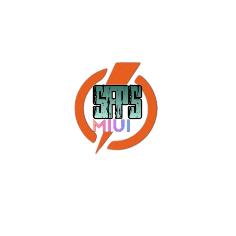

## Introduction
MIUI SFPS module for rooted Android 

The MIUI SFPS module is an LSPosed module, meaning it can only be activated in the LSPosed application

## Benefits of modules
- Can stabilize fps when playing games
- Improve cellphone performance
- Can unlock the highest graphics in the game
  
## bad impact of the module
- If the device does not support it, it can result in bootloop, black screen, and dropped fps.

## NOTE: 
 - The module can only be run on Android 9-14
 - device must be (ROOT)

## Screenshot
 - `docs/image/ss-ff.jpg`
 - `docs/image/ss-ml.jpg`
 - `docs/image/ss-module.jpg`
   
 ## How to install
 - First install LSPosed
 - Download the LSPosed framework on the official website, there are two framework options Zigysk & Riru. If you choose the Zigysk framework, you must turn on Zigysk first in the Magisk Manager application, if you choose the Riru framework, you must install the Riru module first.
 - If you have installed the framework file
 - Just install the LSPosed application

 - Secondly, continue installing the MIUI SFPS module
 - To do this, just install the SFPS MIUI application
 - Then turn on the MIUI SFPS module in the LSPosed application
 - Finally restart your device!! donee

## Downloads
[Github](https://github.com/axxescript/SFPS-MIUI-Module-LSPosed) is the only source where you can get official SFPS MODULE information and downloads.

-  `Recommended`
- 

## Useful Links

- [Bug Reports](https://github.com/axxescript/SFPS-MIUI-Module-LSPosed/issues/1)
- [SFPS MODULE Documentation](https://github.com/axxescript/SFPS-MIUI-Module-LSPosed/)

## License

    SFPS, including all git submodules are free software:
    you can redistribute it and/or modify it under the terms of the
    GNU General Public License as published by the Free Software Foundation,
    either version 3 of the License, or (at your option) any later version.

    This program is distributed in the hope that it will be useful,
    but WITHOUT ANY WARRANTY; without even the implied warranty of
    MERCHANTABILITY or FITNESS FOR A PARTICULAR PURPOSE.  See the
    GNU General Public License for more details.

    You should have received a copy of the GNU General Public License
    along with this program.  If not, see <http://www.gnu.org/licenses/>.
    
